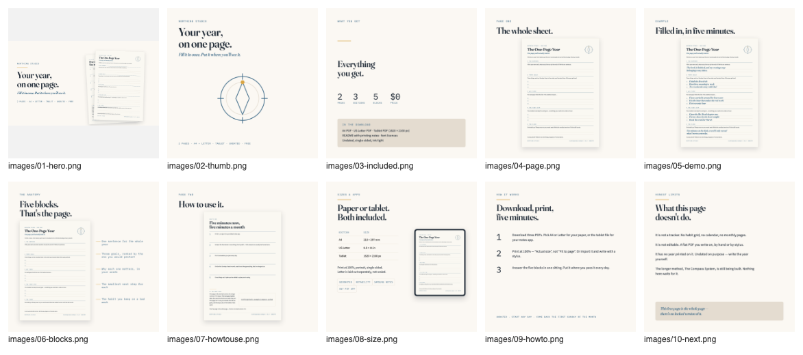

# Listing Instructions — PB-006 The One-Page Year

Everything you need to publish this product by hand. Nothing here has been
published, uploaded or automated. No platform account was touched.

Source of truth for every word below: `Listing/listing.json`. If you change copy,
change it there first, then re-run the gates in §9.

# 1. At a glance

| Field | Value |
|---|---|
| Product | PB-006 The One-Page Year |
| Brand | Northing Studio |
| Price | **$0** (free lead magnet) |
| Launch discount | **None.** The 20%-for-two-weeks rule applies to paid products; this one is free and stays free |
| Optional tier | Pay-what-you-want, minimum $0, suggested **$3** (from the product brief — drop it if you would rather keep the listing clean) |
| Pages | **2** |
| Editions | A4 210 × 297 mm · US Letter 215.9 × 279.4 mm · Tablet 1620 × 2160 px |
| Dated? | Undated |
| Package size | 0.21 MB (Gumroad's cap for $0 products is 250 MB) |
| Version | v1.0 · last updated 12 September 2026 |
| Its job | Earn the email address, the rating, and — once PB-002 exists — the click to it |

**The files to upload** (all in `Products/PB-006 The One-Page Year/dist/`):

| File | What it is |
|---|---|
| `NorthingStudio_One-Page-Year_A4.pdf` | 2 pages, A4 |
| `NorthingStudio_One-Page-Year_Letter.pdf` | 2 pages, US Letter — a genuine re-layout, not a scaled A4 |
| `NorthingStudio_One-Page-Year_Tablet.pdf` | 2 pages, 1620 × 2160 px |
| `README.txt` | printing notes, licence, support line, rating request |
| `licences/` | the three OFL font licences + `FONT-LICENCES.md` |

**Where everything else lives**

- Listing copy: `Products/PB-006 The One-Page Year/Listing/listing.json`
- Listing images: `Products/PB-006 The One-Page Year/Listing/images/` (10 files)
- Artboards and page renders: `Listing/build/`
- Gate output: `Listing/qa/`

# 2. Read this before you publish

Five things are unresolved. Two of them are printed inside the product itself.

> [!WARNING] **The shipped PDFs contain a placeholder domain.** Page 2 of all
> three editions prints `northingstudio.example/compass-system`, and both page
> footers print `northingstudio.example`. That domain does not resolve. It is
> visible at full size in listing image `07-howtouse.png` and legible in the
> footer of `04`, `05` and `06`.
>
> **Do this first:** decide the real URL (or remove the line), have the product
> rebuilt, then re-render the affected listing images. Publishing as-is means
> printing a dead address on a page people pin to a wall.

> [!WARNING] **There is no support contact.** `README.txt` says
> `hello@northingstudio.example`. Supply a real address and have the file
> rebuilt before upload.

> [!NOTE] **PB-002 The Compass System does not exist yet**, so no URL for it is
> claimed anywhere in this copy. Page 2 of the product names it; the listing
> description says plainly that it is still being built.

> [!NOTE] **Nobody has printed this, written on it with a pen, or opened it in
> a tablet app.** Ink coverage (1.7–2.0%) and trim sizes were measured from the
> files, not from paper. See §8 for the checks only you can do.

> [!NOTE] **Etsy cannot take a $0 price.** Etsy charges a $0.20 listing fee per
> listing and we could not confirm that a zero sale price is possible. Publish
> on **Gumroad first**; hold the Etsy listing until you have decided what it
> costs there. All Etsy copy below is ready either way and deliberately never
> uses the word "free".

# 3. Gumroad, step by step

This is the listing to publish first: it takes $0, it captures the email address
at checkout, and it is where the rating comes from.

## 3.1 Create the product

1. **New product → Digital product.**
2. **Name:** `The One-Page Year`
3. **URL / slug:** `one-page-year` → the product URL will be
   `https://northingstudio.gumroad.com/l/one-page-year`.
   *You have registered `northingstudio.gumroad.com`; the full product URL does
   not exist until you create the product, so treat it as unconfirmed until then.*
4. **Price:** set **Pay what you want**, minimum `$0`, suggested `$3`.
   If you would rather keep it a plain freebie, set a flat `$0` instead — that is
   your call, and nothing else in this pack depends on it.
5. **Summary (the one-liner under the title):**

   > One page you'll actually look at.

## 3.2 Upload the files

Upload all five items from `dist/`: the three PDFs, `README.txt`, and the
`licences/` folder. Total 0.21 MB, comfortably inside Gumroad's 250 MB cap for
free products. Do not attach a video — it would push the product over the cap.

## 3.3 Description

Paste the Gumroad description from `listing.json` → `gumroad.description`. It is
reproduced here so you can copy it straight out of this page.

---

**Your year, on one page.**

One sheet you can fill in tonight and pin up tomorrow. Not a system to maintain -
a page to look at.

**What it is.** A two-page PDF, undated. Page 1 is the plan: one sentence for the
year, three goals, why those three, the first step for each, and the one habit
you keep on a bad week. Page 2 is how to use it, in five steps.

**Who it's for**

- You want the year in front of you, not buried in an app.
- You have tried a sixty-page planner and stopped in February.
- You write by hand, on paper or on a tablet.

**Who it's not for**

- You want a tracker. There is no habit grid, no calendar and no monthly pages -
  this is one sheet plus a how-to page.
- You want to edit the text. It is a flat PDF, not a Canva or Word template.
- You want the year printed on it. It is undated by design and has no year field,
  so write the year at the top if you want one there.
- You want a clinical tool. This is for reflection and planning only.

**What's inside**

- 3 PDFs, 2 pages each: A4, US Letter, and a tablet edition
- 5 blocks on page 1: the sentence, three goals, why these, the first step, the floor
- 5 steps on page 2, plus one honest note about what this page does not do
- README.txt with printing notes and the licence, and a licences folder with the three font licences
- 0.2 MB in total

**How it works**

1. Print it, or open it in your tablet notes app.
2. Answer the five blocks in one sitting - about five minutes. First answers are usually the honest ones.
3. Put it somewhere you pass every day, and read it again on the first Sunday of each month.

**Formats.** A4 210 x 297 mm - US Letter 8.5 x 11 in - Tablet 1620 x 2160 px.
Portrait, undated, single-sided. The Letter edition is laid out separately for
the shorter sheet; it is not a scaled A4, so nothing shifts in the margins. Print
at 100% (choose "Actual size", not "Fit to page"). Ink-light: it prints in pure
black and white with no loss.

**Compatibility.** Any app that opens a PDF and lets you write on it - GoodNotes,
Notability and Samsung Notes among them. Flat pages, no interactive fields, one
link on page 2. Plain text here, no logos: we are not affiliated with those apps.

**FAQ**

- *Why is it free?* Because it is how you meet us. It costs you an email address at checkout, and a rating if the page earns one.
- *Is it a cut-down version of something I have to buy?* No. This free page is the whole page - there is no locked version of it.
- *Is it worth paying for?* You do not have to pay anything. If you later want the longer method, a paid product is being built; this sheet does not expire when it arrives.
- *Can I print it more than once?* Yes, as many copies as you like, for yourself.
- *Can I resell or share the file?* No. Personal use only - please do not resell or redistribute it.
- *Will it work on my printer?* It is made for a home printer at 100%. The writing rules are hairlines, so a draft-mode inkjet may print them faintly; the structure still reads.

**Refunds.** It is free, so there is nothing to pay and nothing to refund. If a
file will not open or will not print, email us and we will fix it or tell you why.

**The next step.** This page is the shortest version of a longer method. The
Compass System - how you decide which three goals, and what you do on the weeks
it falls apart - is still being built. It is named on page 2 of this file. There
is no link to it yet, and nothing here depends on it.

A structured self-reflection tool. Not therapy, diagnosis or financial advice.

Last updated 12 September 2026, v1.0. First release.

---

## 3.4 Cover, thumbnail and gallery

| Gumroad field | File | Why |
|---|---|---|
| **Cover (16:9)** | `images/01-hero.png` — 2560 × 1440 | Gumroad displays it at 1280 × 720; rendered at 2× so it stays crisp |
| **Thumbnail (square)** | `images/02-thumb.png` — 2000 × 2000 | A different composition, not a crop of the cover — this is the one that competes in Discover |
| **Gallery, in order** | `03` → `10` | The order in §7 |

## 3.5 Email capture and the receipt

1. Turn **on** the setting that requires an email at checkout — that is the whole
   mechanism of the lead magnet. There is no capture inside the PDF, by design.
2. Add the product to your welcome/email sequence if you have one ready. The
   five-email outline is in the product plan, §"The lead-magnet funnel".
3. **Receipt / content message** — paste from `listing.json` →
   `gumroad.receipt_message`:

   > Thank you - the files are on this page and in your email.
   >
   > Start with the A4 or Letter PDF, whichever matches your paper, and print at
   > 100% ("Actual size"). On a tablet, import the Tablet PDF into your notes app
   > and write on it with a stylus.
   >
   > One instruction, if you only take one: answer the five blocks in one sitting.
   > Don't polish. First answers are usually the honest ones.
   >
   > If the page earned it, a rating takes a few seconds and is the most useful
   > thing you can do for a small shop.
   >
   > This free page is the whole page - there is no locked version of it.
   >
   > A structured self-reflection tool. Not therapy, diagnosis or financial advice.

The rating request matters more than anything else on this listing: ratings are
the cheapest ranking lever we have, and this product exists to earn them.

# 4. Etsy, step by step

**Hold this listing** until §2's price question is settled and the shop name is
claimed. Everything below is ready to paste when it is.

## 4.1 Listing setup

| Field | Value |
|---|---|
| Listing type | **Digital download** (instant download) |
| Category | Paper & Party Supplies → Paper → Stationery → Design & Templates → Templates → Planners & Inserts *(confirm in Etsy's own picker — this path is our best guess, not verified)* |
| Who made it | I did |
| What is it | A finished product |
| When was it made | Made to order / 2020–2026 (whichever Etsy offers for digital work) |
| Renewal | Automatic |
| Digital files | Upload **3 PDFs + README.txt** (Etsy allows 5 files × 20 MB; ours total 0.21 MB). The `licences/` folder cannot be uploaded as a folder — either zip it with the README, or leave the licences in the ZIP you build for Gumroad and mention them in the README |
| Personalisation | **Off.** There is nothing to personalise; turning it on invites messages we cannot answer |
| Variations | **None.** All three editions are in one download |
| Price | **Unresolved — see §2.** Etsy has a $0.20 listing fee and we could not confirm a $0 sale price |

## 4.2 Title — paste exactly

```
One Page Goal Sheet Printable | Your Year on One Page | Undated Goal Planner, A4 + Letter + GoodNotes PDF
```

**105 characters** of Etsy's 140. The head phrase is 29 characters, so it survives
the ~50–60 character truncation in the search grid.

Note the title does **not** say "free". If you list it on Etsy at any price, the
word would be a lie; if Etsy ever allows $0, add it then.

## 4.3 Tags — exactly 13, each ≤20 characters

| # | Tag | Chars | # | Tag | Chars |
|---|---|---|---|---|---|
| 1 | one page goal sheet | 19 | 8 | goodnotes template | 18 |
| 2 | year on one page | 16 | 9 | vision sheet | 12 |
| 3 | goal planner | 12 | 10 | intention setting | 17 |
| 4 | undated planner | 15 | 11 | reflection sheet | 16 |
| 5 | yearly goals | 12 | 12 | personal growth | 15 |
| 6 | new year planner | 16 | 13 | digital planner | 15 |
| 7 | minimalist planner | 18 | | | |

**Materials:** PDF, printable, digital download.

These keywords are **judgement, not measured data**. We cannot see Etsy's search
volume and we do not scrape Etsy. They come from the product brief, the research
report's keyword clusters, and how buyers phrase this in public search results.

## 4.4 Description — paste from `listing.json` → `etsy.description`

It is the same nine-part structure as the Gumroad copy, in plain text with no
Markdown, because Etsy strips formatting. Two differences: it names the Etsy
refund position ("an instant digital download, so nothing is posted to you"), and
it says "message us" rather than "email us".

## 4.5 Images

Etsy allows up to 20; upload all ten, in the order in §7. Etsy's primary image is
square — use `02-thumb.png`. `01-hero.png` is 16:9 and will be letterboxed on
Etsy, so put it second, not first.

# 5. Pricing and discounts

- **Price: $0.** It stays $0. This product's return is the email address, the
  rating and brand recognition — not revenue.
- **No launch discount.** The plan's "roughly 20% off for exactly two weeks, then
  back to list price and stays there" applies to the paid products. There is
  nothing to discount here, so there is no end date to diarise.
- **No struck-through price.** This has never been sold at any price, so showing
  one would be a lie.
- **Optional support tier** — pay-what-you-want with a $3 suggestion, from the
  product brief. Your call. If you use it, keep the minimum at $0 so the product
  stays genuinely free.
- **If you later list on Etsy at a price**, remember it changes the copy's
  honesty: strip "free" from the description's FAQ ("Why is it free?") and adjust
  the "nothing to refund" line. Come back to `listing.json` and re-run the gates.

# 6. Disclaimers and policy

**The disclaimer, exactly as written, no edits:**

> A structured self-reflection tool. Not therapy, diagnosis or financial advice.

It appears in four places, all already done: page 1 of every edition, `README.txt`,
the listing description (both platforms), and the Gumroad receipt message.

**Refund position.** The product is free, so the line is "nothing to pay, nothing
to refund; if a file will not open, tell us and we will fix it". **No refund
promise or outcome promise of any kind appears anywhere** — that decision is still
open (product plan, open question 5) and `banned_terms.py` fails that word inside
a product for exactly this reason.

**Licence line** (already in `README.txt`): personal use, print as many copies as
you like for yourself, no reselling or redistribution. The fonts are SIL OFL 1.1
and their licences ship in `licences/`.

**What we must not claim, on either platform:**

- No sales counts, download counts, star ratings, reviews or testimonials. We have none.
- No "bestseller", "#1", "top rated".
- No refund or outcome promise until you decide.
- No trademarked method names — the ban list is enforced by the gate and includes
  a live US registration in our exact goods class.
- No app logos or platform-endorsement badges. GoodNotes, Notability and Samsung
  Notes appear as plain text only, with "we are not affiliated" stated.
- No clinical framing of any kind. We score nothing and assess no one.

# 7. The images

Ten images, all rendered at exact platform sizes from the real product pages via
headless Chrome. No stock photography, no third-party logos, no invented proof.



| # | File | Size | Role | Headline | Why it is there |
|---|---|---|---|---|---|
| 1 | `01-hero.png` | 2560 × 1440 | HERO 16:9 | "Your year, on one page." | Gumroad cover. Benefit left, a two-page stack right — never a device and a stack in one frame |
| 2 | `02-thumb.png` | 2000 × 2000 | HERO square | "Your year, on one page." | The grid thumbnail, and a different composition, not a crop: warm paper, one compass device, one brass marker, spec strip at the base. The research found only one warm, light, editorial thumbnail in the whole competitor set |
| 3 | `03-included.png` | 2000 × 2000 | INCL | "Everything you get." | Counts a buyer can check: 2 pages, 3 editions, 5 blocks, $0 |
| 4 | `04-page.png` | 2000 × 2000 | PAGES | "The whole sheet." | Page 1 at a size where the prompts are readable. Most free competitors show nothing |
| 5 | `05-demo.png` | 2000 × 2000 | DEMO | "Filled in, in five minutes." | A worked example — the research names "no example of a completed page" as a competitor weakness twice. The answers are set in the brand italic and labelled EXAMPLE; they are an illustration, not a claim about anyone |
| 6 | `06-blocks.png` | 2000 × 2000 | FEAT | "Five blocks. That's the page." | The anatomy, callout-labelled |
| 7 | `07-howtouse.png` | 2000 × 2000 | PAGES | "How to use it." | Page 2, so nothing is hidden before purchase. **Holds the placeholder URL at full size — do not upload until the rebuild** |
| 8 | `08-size.png` | 2000 × 2000 | SIZE + COMPAT | "Paper or tablet. Both included." | Sizes as plain numbers; app names as plain text chips |
| 9 | `09-howto.png` | 2000 × 2000 | HOWTO | "Download, print, five minutes." | Removes the download-and-print objection |
| 10 | `10-next.png` | 2000 × 2000 | Honest limits | "What this page doesn't do." | See the deviation note below |

**Two deviations from the brief's 10-slot plan, both deliberate:**

- **Slot 7 was "a copy pinned above a desk".** That needs a photograph or a drawn
  desk scene. We use no stock photography, and inventing a room would be a mockup
  of something that does not exist, so slot 7 shows page 2 instead. If you
  photograph a printed copy on your own wall, that image can replace it — a real
  photo of the real page is better than anything here.
- **Slot 10 was "the honest upgrade path to PB-002".** PB-002 does not exist and
  has no URL, so the slot carries the honest-limits message instead (the critique
  called that line the strongest copy in the product). Replace it with a proper
  cross-sell image once PB-002 is live.

**The 220 px test.** Every image was shrunk to 220 px and looked at — that is the
width of a search-grid cell, and the moment the buyer actually decides. Result:
the headline is legible in all ten. `02-thumb` is the strongest at that size (one
compass, five words, nothing else). In `04`, `05`, `06` and `07` the page bodies
become texture, as expected — the headline carries them. The step text in `09` and
the bullets in `10` are not readable at 220 px and are not meant to be; they are
read at full size after the click.

**If you rebuild the PDFs** (and you should — see §2), re-render the page images
and every artboard that uses them:

```bash
D="Products/PB-006 The One-Page Year"
python3 .claude/skills/printable-pdf/scripts/render_pages.py \
    "$D/dist/NorthingStudio_One-Page-Year_A4.pdf" --out "$D/Listing/build/pages" --width 1800
python3 .claude/skills/printable-pdf/scripts/render_pages.py \
    "$D/dist/NorthingStudio_One-Page-Year_Tablet.pdf" --out "$D/Listing/build/pages" --pages 1 --width 1400
python3 .claude/skills/listing-images/scripts/render_artboard.py \
    "$D/Listing/build/01-hero.html" -o "$D/Listing/images/01-hero.png" --size 2560x1440
for n in 02-thumb 03-included 04-page 05-demo 06-blocks 07-howtouse 08-size 09-howto 10-next; do
  python3 .claude/skills/listing-images/scripts/render_artboard.py \
      "$D/Listing/build/$n.html" -o "$D/Listing/images/$n.png" --size 2000x2000
done
```

# 8. Post-publish checklist

Do these in order. The first four are the ones nobody has done yet.

- [ ] **Print one A4 sheet and one Letter sheet** at 100%, on the printer you would
      expect a buyer to have. Check the hairline writing rules survive and the
      margins are right. This is the highest-risk unverified item in the product.
- [ ] **Write on it with a normal pen.** The lines are 7.5 mm apart. Check the
      `1. 2. 3.` numerals do not crowd the start of a line.
- [ ] **Print one page in pure greyscale** on a mono laser, if you have one.
- [ ] **Open the Tablet PDF in at least one tablet app** and write on it with a
      stylus. `README.txt` names GoodNotes, Notability and Samsung Notes; none has
      been opened on a real device. If you can only test one, test one — and if a
      claim fails, cut that app's name from the README and from `listing.json`
      before publishing.
- [ ] Buy your own product at $0 and check the whole delivery: the files download,
      all three PDFs open, the README reads correctly, the receipt message is right.
- [ ] Open every uploaded image on the live listing at phone width.
- [ ] Check the title and all 13 tags saved exactly as written — platforms silently
      trim.
- [ ] Confirm the price shows as $0 (and the suggested $3, if you used it).
- [ ] Confirm the changelog date in the description matches the files you actually
      uploaded.
- [ ] Ask one person who has never seen it to look at the thumbnail for two seconds
      and tell you what the product is.

# 9. Gate output

Both gates were run against the files in this folder. This is the real output,
pasted unedited.

**`check_listing.py`** — counts the title and tags, demands the nine description
sections, rejects unearned proof claims, and cross-checks the claimed page count
and formats against the shipped PDFs:

```
$ python3 .claude/skills/listing-copy/scripts/check_listing.py \
    "Products/PB-006 The One-Page Year/Listing/listing.json" \
    --dist "Products/PB-006 The One-Page Year/dist" \
    --json "Products/PB-006 The One-Page Year/Listing/qa/listing.json"
  shipped: NorthingStudio_One-Page-Year_A4.pdf  {'pages': 2, 'mm': (210, 297)}
  shipped: NorthingStudio_One-Page-Year_Letter.pdf  {'pages': 2, 'mm': (216, 279)}
  shipped: NorthingStudio_One-Page-Year_Tablet.pdf  {'pages': 2, 'mm': (429, 572)}

PASS — 0 blocking, 0 warning(s).
```

The claimed 2 pages and the A4 / Letter / Tablet editions are confirmed against
the actual PDFs, not against the spec's intentions.

**`banned_terms.py`** — scans this instruction file for trademarked method names,
unsafe claims and hype, and requires the reflection disclaimer:

```
$ python3 .claude/skills/product-qa/scripts/banned_terms.py \
    "Products/PB-006 The One-Page Year/Listing/Listing Instructions.md" \
    --require-disclaimer reflection
PASS — no banned names, no unsafe claims.
```

# 10. Still assumed, still blocked

**Blocked — fix before publishing**

1. **The placeholder domain inside the product.** `northingstudio.example/compass-system`
   on page 2 of all three editions, `northingstudio.example` in both footers.
   Rebuild, then re-render the images.
2. **No support contact.** `hello@northingstudio.example` in `README.txt`.
3. **PB-002 has no URL** because the product has not been built. Nothing here
   claims one.
4. **The Etsy price.** Etsy has a $0.20 listing fee and we could not confirm a $0
   sale price is allowed. Gumroad first.
5. **The tablet-app claim is untested.** No edition has been opened in GoodNotes,
   Notability or Samsung Notes on a real device.
6. **Nothing has been printed or written on.** Ink coverage of 1.7–2.0% and the
   trim sizes were measured from the files.

**Assumptions — yours to confirm**

1. **The Gumroad slug `one-page-year`** is a proposal. You own
   `northingstudio.gumroad.com`; the full product URL does not exist until you
   create the product.
2. **The Etsy shop does not exist yet.** Nothing in this pack claims it does.
3. **The Etsy category path and attributes** are our best guess at Etsy's current
   tree. Confirm them in Etsy's own picker.
4. **Etsy's limits** (140-character title, exactly 13 tags of ≤20 characters) come
   from the listing-copy skill, checked 12 September 2026. Re-check before you
   publish; platforms change them.
5. **Keyword choices are judgement, not evidence.** No Etsy search-volume data was
   used, and Etsy was not scraped.
6. **The $3 support tier** comes from the product brief. A clean $0 is equally fine.
7. **"Northing Studio" is unscreened for trademark.** The brand kit's own screen
   returned a conflict finding, which you accepted knowingly; a professional search
   is still outstanding.
8. **The free-listing structure** (a separate free listing rather than a $0 tier
   inside a paid one) follows the plan's recommendation, open question 3.
9. **The refund promise** (open question 5) is undecided, so no promise of any kind
   appears in this copy.

**Owner decisions that would improve this listing later**

- A photograph of a printed copy pinned to a real wall would beat any artboard we
  can render for slot 7.
- Once PB-002 is live, slot 10 becomes a real cross-sell, and page 2's link becomes
  real.
- A year field on page 1 was raised in the critique as a genuine gap: the product
  is sold as reusable across years and has nowhere to write the year. The listing
  copy states this plainly rather than hiding it.
