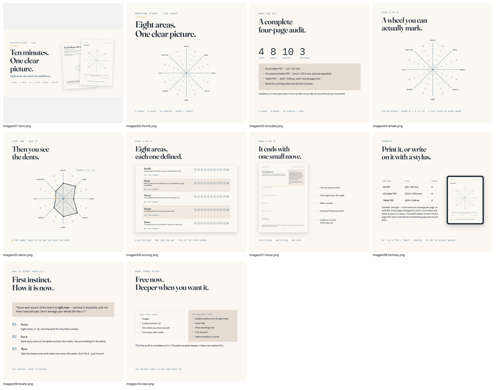
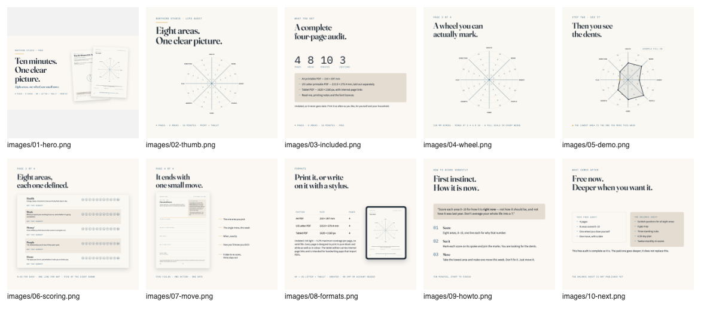

# Listing Instructions — PB-022 The 10-Minute Life Audit

**Northing Studio · Version 1.0 · Prepared 12 September 2026**

Everything needed to put this product on Gumroad and Etsy by hand. Nothing here
has been published, and nothing here should be published until section 1 is
cleared. Copy comes from `listing.json`, which is the single source of truth; if
this document and that file ever disagree, the JSON is right.

> [!WARNING] **Stop. This package cannot go live today.**
> `dist/README.txt` still contains the literal string
> `<SUPPORT CONTACT - owner to insert before the listing goes live>`.
> That string ships to the buyer exactly as written. Fix it first — see section 1.

# 1. Before you touch either platform

Three things must be settled. Two of them are yours alone; none of them can be
invented for you.

## 1.1 The support contact — a hard blocker

Open `Products/PB-022 The 10-Minute Life Audit/dist/README.txt`, find the
**SUPPORT** section near the bottom, and replace this line:

```
  <SUPPORT CONTACT - owner to insert before the listing goes live>
```

with a real address you will actually read, for example a shop contact email. It
is the only placeholder left in the package. The build log calls it "the one
thing that makes this package unreleasable today" and that is accurate.

## 1.2 Etsy will not accept a price of $0.00

The Product Plan recommends "separate free listings for PB-006 and PB-022".
**On Gumroad that works exactly as written. On Etsy it does not** — Etsy requires
a positive listing price, so a genuinely free Etsy listing is not possible.
(Confirm the current minimum in Etsy's own Seller Handbook. We do not scrape
Etsy and this document is not authority on their fees.)

Pick one before you start:

| Option | What you do | Cost of it |
|---|---|---|
| **A — Gumroad only** (recommended) | Publish the free product on Gumroad at $0. Skip the Etsy listing entirely until a paid product exists. | No Etsy presence yet, so no Etsy reviews yet either. |
| **B — Etsy at the minimum price** | List it on Etsy at Etsy's minimum. Then remove the word "free" from the Etsy title, tags and description, and re-render image 03. | It is no longer a lead magnet on Etsy, and the copy must change. |
| **C — Etsy as a bonus** | Hold it back and attach it as an extra file inside the first paid Etsy listing. | Delays it until a paid product is built. |

Section 2 is written for **option A or C**. If you choose **B**, section 2.6 lists
every line that has to change.

## 1.3 There is no link for The Balance Audit

PB-003 does not exist yet. The listing copy names it and describes what it adds,
and **deliberately carries no URL**. Page 4 of the PDF has the same gap — the spec
asked for an outbound link there and the builder correctly refused to invent one.
Do not add a link on either platform until that product is live.

# 2. At a glance

| Field | Value |
|---|---|
| Product | **The 10-Minute Life Audit** (PB-022) |
| Brand | Northing Studio |
| Price | **$0** — free |
| Launch discount | **None.** A free product has nothing to discount. |
| Pages | **4** |
| Editions | A4 · US Letter · Tablet |
| Dated? | Undated |
| Version | 1.0, last updated 12 September 2026 |
| Purpose | Lead magnet. It funnels into PB-003 The Balance Audit. |

## Files, and where they live

Everything is under `Products/PB-022 The 10-Minute Life Audit/`.

| File | What it is |
|---|---|
| `dist/NorthingStudio_10-Minute-Life-Audit_A4.pdf` | 4 pp, 210 × 297 mm |
| `dist/NorthingStudio_10-Minute-Life-Audit_Letter.pdf` | 4 pp, 215.9 × 279.4 mm, separately laid out |
| `dist/NorthingStudio_10-Minute-Life-Audit_Tablet.pdf` | 4 pp, 1620 × 2160 px, 6 internal page links |
| `dist/README.txt` | printing notes, licence, support, rating request |
| `dist/licences/` | `FONT-LICENCES.md`, three OFL texts, `manifest.json` |
| `Listing/listing.json` | all the copy, machine-readable |
| `Listing/images/01-hero.png` … `10-next.png` | the ten listing images |
| `Listing/build/` | artboard HTML, page renders, contact sheets |
| `Listing/qa/` | gate output |

Package total is about **484 KB across 9 files** — far inside Gumroad's 250 MB
free-product limit.

## Make the upload bundle

Etsy accepts a small number of separate files and no folders, so the `licences/`
folder has to be zipped. **Do this after fixing the README**, or you will ship the
placeholder inside the ZIP as well.

```bash
cd "Products/PB-022 The 10-Minute Life Audit/dist"
zip -r "NorthingStudio_10-Minute-Life-Audit_v1.0.zip" \
    NorthingStudio_10-Minute-Life-Audit_A4.pdf \
    NorthingStudio_10-Minute-Life-Audit_Letter.pdf \
    NorthingStudio_10-Minute-Life-Audit_Tablet.pdf \
    README.txt licences
```

# 3. Gumroad, step by step

This is the platform the free product is actually for. Do this one first.

## 3.1 Create the product

| Gumroad field | What to enter |
|---|---|
| Type | Digital product |
| Name | `The 10-Minute Life Audit` |
| URL / permalink | `10-minute-life-audit` |
| Price | **$0**. Set "Pay what you want" with a minimum of **$0** and a suggested price of **$0**. Do not suggest a figure — it makes a free product feel conditional. |
| Summary / subtitle | `A clear picture, then one small move.` |
| Currency | USD |

The product URL will then be
`https://northingstudio.gumroad.com/l/10-minute-life-audit`.
**That URL is a proposal, not a fact** — the subdomain is registered, the product
is not created yet. Check what Gumroad actually gives you and correct it
everywhere before you share it.

## 3.2 Files

Upload all of it — Gumroad handles folders and multiple files happily:

- the three PDFs
- `README.txt`
- the `licences/` folder (or the ZIP from section 2)

## 3.3 Cover and thumbnail

| Gumroad slot | Image | Size |
|---|---|---|
| Cover (first) | `images/01-hero.png` | 2560 × 1440 (displays at 1280 × 720) |
| Thumbnail | `images/02-thumb.png` | 2000 × 2000 |
| Further covers, in this order | `05-demo`, `04-wheel`, `03-included`, `06-scoring`, `07-move`, `09-howto`, `08-formats`, `10-next` | 2000 × 2000 each |

## 3.4 Description

Paste `gumroad.description` from `listing.json` verbatim. It is Markdown and
Gumroad's editor accepts headings, bold, lists and a table. Check the table
survives the paste; if it does not, retype the three format rows as a list.

**Do not add anything.** In particular do not add a refund promise (section 5),
a rating count, or a link to The Balance Audit.

## 3.5 Content / receipt message

Gumroad shows this after purchase and in the receipt email. Paste
`gumroad.receipt_message` from `listing.json`:

> Thank you — your four pages are attached.
>
> Start with page 1. It takes about ten minutes: eight scores, one wheel, one
> small move.
>
> Print the A4 or US Letter edition at 100% / "Actual size" (not "Fit to page"),
> or open the tablet edition in your handwriting app as a document rather than a
> photo, so the internal links survive.
>
> If it was worth the ten minutes, a rating helps more than you would think — it
> is the only reason anyone else finds it.
>
> Something wrong with a file? Reply to this email and we will put it right.

That last line only works once section 1.1 is done.

## 3.6 Settings to check

- **Email capture: on.** Gumroad collects the buyer's email on a free download by
  default. This is the entire point of the lead magnet — leave it on.
- **Ratings: on.** Reviews are the cheapest ranking lever we have.
- **Discover / taxonomy:** put it under self-improvement or productivity,
  whichever Gumroad currently offers. Tags are free-form on Gumroad; reuse the
  thirteen Etsy tags in section 4.2.
- **Audience / mailing list:** if you have one, add new buyers to it. Say so on
  the checkout page if Gumroad requires you to.

# 4. Etsy, step by step

Only if you chose option B or C in section 1.2. **Under option A, skip this whole
section.**

## 4.1 Listing setup

| Etsy field | What to enter | Confidence |
|---|---|---|
| Listing type | Digital download (instant download) | certain |
| Category | Search the category field for **Templates**; the path is roughly *Paper & Party Supplies → Paper → Stationery → Design & Templates → Templates* | **check it in Etsy's own form — their taxonomy changes and this is a best guess** |
| Who made it | I did | certain |
| What is it | A finished product | certain |
| When was it made | Made in 2026 | check the wording Etsy offers |
| Renewal | Your choice. Automatic renewal is simpler; each renewal costs a listing fee. | |
| Primary colour | White | optional |
| Secondary colour | Blue | optional |
| Holiday / Occasion | Leave blank — nothing here is seasonal | |
| Materials | `Printable PDF`, `Digital download`, `A4 and US Letter` | optional |
| Personalisation | **Off.** There is nothing to personalise. | certain |
| Variations | **None.** All three editions are in one download. | certain |

## 4.2 Title and tags

**Title — paste exactly, 124 characters of Etsy's 140:**

```
Life Audit Printable | Score 8 Life Areas in 10 Minutes | Balance Wheel Worksheet, Self Reflection PDF, A4 + Letter + Tablet
```

The head phrase is `Life Audit Printable`, 20 characters, so it survives the
search grid's truncation at roughly 50–60.

**The thirteen tags** — Etsy allows exactly thirteen, each no more than twenty
characters. Every one below has been counted.

| # | Tag | Chars | # | Tag | Chars |
|---|---|---|---|---|---|
| 1 | `life audit` | 10 | 8 | `printable worksheet` | 19 |
| 2 | `self assessment` | 15 | 9 | `scorecard` | 9 |
| 3 | `balance wheel` | 13 | 10 | `goal setting sheet` | 18 |
| 4 | `self reflection` | 15 | 11 | `goodnotes planner` | 17 |
| 5 | `life areas` | 10 | 12 | `monthly check in` | 16 |
| 6 | `life balance chart` | 18 | 13 | `instant download` | 16 |
| 7 | `personal growth` | 15 | | | |

These are **judgement, informed by the research report's keyword clusters and by
how buyers phrase this in public search results**. They are not measured demand:
we cannot see Etsy's search volume, and we do not scrape Etsy.

## 4.3 Description

Paste `etsy.description` from `listing.json` verbatim. It is plain text with rule
lines, because Etsy does not render Markdown.

## 4.4 Digital files

Etsy caps you at five files. Upload exactly these five:

1. `NorthingStudio_10-Minute-Life-Audit_v1.0.zip` (everything, folders intact)
2. `NorthingStudio_10-Minute-Life-Audit_A4.pdf`
3. `NorthingStudio_10-Minute-Life-Audit_Letter.pdf`
4. `NorthingStudio_10-Minute-Life-Audit_Tablet.pdf`
5. `README.txt`

The three loose PDFs are there so a buyer who does not want to unzip anything
still gets what they came for.

## 4.5 Image order

Etsy shows the first image as the thumbnail. Use this order:

| Etsy slot | File | Why it is here |
|---|---|---|
| 1 | `02-thumb.png` | The brand thumbnail. Cleanest read in a search grid, and it shows the real product rather than a filled-in example. |
| 2 | `05-demo.png` | The promise: a wheel with a dent in it. Second because its "Example fill-in" label is not legible at grid size, and nobody should think the pages arrive pre-filled. |
| 3 | `04-wheel.png` | The blank wheel at full size, so the buyer can see it is genuinely markable. |
| 4 | `03-included.png` | Counts and the file list. |
| 5 | `06-scoring.png` | Page 2, at a size where the eight definitions are readable. |
| 6 | `07-move.png` | Page 4, callout-labelled. |
| 7 | `09-howto.png` | The one rule that makes the scores honest. |
| 8 | `08-formats.png` | Three editions, real dimensions, the tablet. |
| 9 | `10-next.png` | What comes after, stated honestly. |
| 10 | `01-hero.png` *(optional)* | It is 16:9, so Etsy will letterbox or crop it. Drop it if it looks wrong. |

## 4.6 If you chose option B (paid Etsy listing)

Change these, and only these:

- Remove the word **FREE** from image `03-included.png`. Edit
  `Listing/build/03-included.html`, change the last `.spec` line to
  `4 PAGES · 8 AREAS · 10 MINUTES · A4 + LETTER + TABLET`, then re-render:
  ```bash
  python3 .claude/skills/listing-images/scripts/render_artboard.py \
    "Products/PB-022 The 10-Minute Life Audit/Listing/build/03-included.html" \
    -o "Products/PB-022 The 10-Minute Life Audit/Listing/images/03-included.png" \
    --size 2000x2000
  ```
- In the Etsy description, delete the sentence "Free." at the end of **WHAT IT
  IS**, and rewrite the first FAQ ("Is it really free, and what is the catch?")
  so it answers the price instead.
- Keep the tag `instant download`; there is no "free" tag in the set to remove.
- Set `price_usd` in `listing.json` to the Etsy figure, with a comment saying it
  applies to Etsy only, and re-run the gate in section 7.

# 5. Pricing, discounts and policy

## 5.1 Price

**$0 on Gumroad. No discount, no launch window, no expiry date.** The Product
Plan's rule — about 20% off for exactly two weeks, then list price, and it stays
there — applies to the paid products. There is nothing to take 20% off here.

When PB-003 The Balance Audit launches at $19, *it* gets the two-week launch
window. This product does not change price, ever. It is free permanently.

## 5.2 Refunds

This is a free digital download, so there is nothing to pay and nothing to return.
The description says exactly that, and adds that a broken or unopenable file will
be put right.

**Do not add a refund promise to either platform.** Whether the shop offers a
plain 30-day no-questions refund on *paid* products is an open owner decision in
the Product Plan's pricing rationale, and it is not settled. The QA gate blocks
the word for exactly this reason.

## 5.3 What we must never claim

- No sales counts, download counts, ratings, review quotes or testimonials. We
  have none, on either platform.
- No "bestseller", no "#1", no "top rated".
- No struck-through price. Nothing was ever charged for this.
- No promise about what the audit will do to anyone's life.
- No app logos or platform badges. "Intended for GoodNotes and Notability" is
  plain text and stays plain text.
- **Never the registered phrase named in section 6, anywhere.**

## 5.4 The disclaimers

Both already appear on page 1 and page 4 of the PDF, in `README.txt`, and in both
platform descriptions. Do not paraphrase either of them.

> This is a structured self-reflection tool. It is not a diagnosis, an assessment
> or therapy. If something here worries you, talk to someone qualified — that is
> a strong move, not a weak one.

> Money here is about how you feel about your money, not advice about it. This is
> not financial advice.

# 6. The compliance rule that must not slip

There is a **live US trademark registration** — Reg. 3918518, Ser. 77779648,
Success Motivation International, Inc. — on the common three-word name for this
kind of diagram. It covers books, booklets, manuals and printed instructional
materials for personal development, goal setting and planning. That is our exact
category of goods.

**The exact phrase is deliberately not typed anywhere in this document**, because
the QA gate treats every occurrence as a failure — including one inside a warning
about it. It is written out in two places you can open: the Risks table in
`Product Plans/brand-kit.md`, and `.claude/skills/product-qa/assets/banned.json`.

**It must appear nowhere**: not in a title, a tag, a description, an image, a file
name, a folder name, the alt text, the PDF metadata, or a reply to a customer
question. Our wording is:

- **"the eight-area wheel"**
- **"the balance wheel diagram"**
- **"your wheel"**

The product itself has been checked four ways — content, file names, extracted
PDF text and PDF metadata — and is clean. This listing has been checked by
`check_listing.py`, which loads the ban list and fails on a match. It passed.

If a buyer uses the phrase in a review or a question, do not repeat it back.

# 7. Gate output — real, not summarised

Both gates were run on the files as they stand, on 12 September 2026.

## 7.1 `check_listing.py` — claims against the shipped PDFs

```
$ python3 .claude/skills/listing-copy/scripts/check_listing.py \
    "Products/PB-022 The 10-Minute Life Audit/Listing/listing.json" \
    --dist "Products/PB-022 The 10-Minute Life Audit/dist" \
    --json "Products/PB-022 The 10-Minute Life Audit/Listing/qa/listing.json"

  shipped: NorthingStudio_10-Minute-Life-Audit_A4.pdf  {'pages': 4, 'mm': (210, 297)}
  shipped: NorthingStudio_10-Minute-Life-Audit_Letter.pdf  {'pages': 4, 'mm': (216, 279)}
  shipped: NorthingStudio_10-Minute-Life-Audit_Tablet.pdf  {'pages': 4, 'mm': (429, 572)}

PASS — 0 blocking, 0 warning(s).
```

What that actually proves: the title is within 140 characters, there are exactly
thirteen tags and none is over twenty characters, no banned trademark name
appears in any of the copy, no unearned proof claim appears, all nine description
sections are present, the disclaimer is recorded and present in the description,
and **the claimed 4 pages and the claimed A4 / Letter / Tablet editions match the
PDFs that actually shipped**.

## 7.2 `banned_terms.py` — this document

```
$ python3 .claude/skills/product-qa/scripts/banned_terms.py \
    "Products/PB-022 The 10-Minute Life Audit/Listing/Listing Instructions.md" \
    --require-disclaimer reflection \
    --json "Products/PB-022 The 10-Minute Life Audit/Listing/qa/terms.json"

  wrote Products/PB-022 The 10-Minute Life Audit/Listing/qa/terms.json

PASS — no banned names, no unsafe claims.
```

That run is clean on the third attempt, and the two earlier failures are worth
recording rather than hiding:

1. The first run **failed on three counts of the registered phrase — all three
   inside my own warnings about it.** The gate is a plain substring match and it
   is right to be: a document that types the phrase is a document that can be
   copied and pasted into a listing. Section 6 now describes the mark instead of
   naming it.
2. It also raised two tone warnings, both since rewritten: an ease-claim adverb
   in the image notes, and a verb quoted out of the product's own page 4.
   The same lesson applies — a gate that matches substrings also matches a
   note *about* the substring, so neither is typed here either.

The reflection disclaimer was detected on every run.

# 8. The images

Ten images, built from the real product pages — every page picture in them comes
from `render_pages.py` run on the shipped A4 and tablet PDFs. Nothing is redrawn
and nothing is mocked up.



| # | File | Size | Role | Headline |
|---|---|---|---|---|
| 1 | `01-hero.png` | 2560 × 1440 | HERO | Ten minutes. One clear picture. |
| 2 | `02-thumb.png` | 2000 × 2000 | HERO | Eight areas. One clear picture. |
| 3 | `03-included.png` | 2000 × 2000 | INCL | A complete four-page audit. |
| 4 | `04-wheel.png` | 2000 × 2000 | PAGES | A wheel you can actually mark. |
| 5 | `05-demo.png` | 2000 × 2000 | DEMO | Then you see the dents. |
| 6 | `06-scoring.png` | 2000 × 2000 | PAGES | Eight areas, each one defined. |
| 7 | `07-move.png` | 2000 × 2000 | FEAT | It ends with one small move. |
| 8 | `08-formats.png` | 2000 × 2000 | SIZE | Print it, or write on it with a stylus. |
| 9 | `09-howto.png` | 2000 × 2000 | HOWTO | First instinct. How it is now. |
| 10 | `10-next.png` | 2000 × 2000 | BUNDLE | Free now. Deeper when you want it. |

## 8.1 The 220 px test — what it showed

Every image was shrunk to 220 px wide, which is roughly what a buyer sees in a
search grid, and looked at.



**All ten headlines are legible at 220 px.** Findings worth knowing:

- **`05-demo` has the most punch at grid size.** The joined, dented shape is the
  only solid form in the set and it reads at once. It is second rather than
  first on Etsy only because its "Example fill-in" label is *not* legible at
  220 px, and a buyer should not think the pages arrive already filled in.
- **`02-thumb`'s blank wheel reads as a faint starburst**, not as a diagram. That
  is honest — the real page is a hairline drawing on warm paper — and the
  headline carries the image on its own. It is the cleanest, most brand-typical
  tile in the set.
- **Body text, spec strips and page prompts are all unreadable at 220 px**, on
  every image. That is expected and correct; they are there for the buyer who has
  already clicked.
- **`06-scoring`** reads as visible page structure rather than words, which is
  the right signal at that size: it says "this is a real worksheet".
- **`01-hero`** is 16:9, so in a square grid cell it letterboxes. It is the
  Gumroad cover, not an Etsy thumbnail, and should not be judged here.

Two things were redesigned rather than excused after this test: `06-scoring`
originally cut the 0–10 scale in half and clipped two rows mid-sentence, and
`10-next` originally had two panels that were 80% empty — the same defect the
product critic found on page 4 of the PDF itself.

## 8.2 Rebuilding an image

```bash
D="Products/PB-022 The 10-Minute Life Audit/Listing"
python3 .claude/skills/listing-images/scripts/render_artboard.py \
    "$D/build/04-wheel.html" -o "$D/images/04-wheel.png" --size 2000x2000
sips -Z 220 "$D/images/04-wheel.png" --out /tmp/t.png   # then look at it
```

# 9. Post-publish checklist

Work down this list with the live listing open.

- [ ] The support address in `README.txt` is real, and a test email to it arrives.
- [ ] Download your own product as a buyer would. Open all three PDFs.
- [ ] Print page 3 of the A4 edition at 100% and mark the wheel with a real pen.
      This is the single most valuable check in the product, and nobody has done
      it yet — see section 10.
- [ ] The tablet PDF imports into your handwriting app as a document, and all six
      internal page links work.
- [ ] Price shows as **$0** / free on Gumroad.
- [ ] The Gumroad URL in your own notes matches the one Gumroad actually issued.
- [ ] Email capture is on, and a test download produces an email address you can see.
- [ ] The receipt message renders with its line breaks intact.
- [ ] All images are right way up, uncropped and in the intended order.
- [ ] Search the live page for the registered phrase in section 6. Zero hits.
- [ ] The description shows both disclaimers in full.
- [ ] There is no refund promise, no rating claim and no sales number anywhere.
- [ ] The changelog line reads "Version 1.0 — last updated 12 September 2026" and
      that is still the truth.
- [ ] No link to The Balance Audit exists anywhere yet.

# 10. Still assumed, still open, still blocked

Nothing in this section has been resolved, and none of it should be guessed at.

## 10.1 Blocking

| # | Item | What has to happen |
|---|---|---|
| 1 | **`README.txt` support placeholder** | Replace `<SUPPORT CONTACT - owner to insert before the listing goes live>` with a real address. Until then the package cannot ship. |
| 2 | **Etsy cannot take a $0.00 price** | Choose option A, B or C in section 1.2. |
| 3 | **No PB-003 URL** | The Balance Audit is not built. Copy names it, links nowhere. Do not invent a URL. |

## 10.2 Unconfirmed

| # | Item | Note |
|---|---|---|
| 4 | `https://northingstudio.gumroad.com/l/10-minute-life-audit` | The subdomain is registered; the product is not created. The slug is a proposal. |
| 5 | The Etsy shop name | You will claim it directly. Nothing in this listing asserts an Etsy shop exists. |
| 6 | The brand name **Northing Studio** | Your decision, taken knowingly, but its conflict screen returned CONFLICT and a professional trademark search is still outstanding (`brand-kit.md` v2). That risk is yours and it is recorded. |
| 7 | The Etsy category path and attributes in section 4.1 | A best guess at Etsy's current taxonomy. Etsy's own form is the only authority. |
| 8 | Etsy's current minimum listing price and fees | Verify in Etsy's Seller Handbook. We do not scrape Etsy. |

## 10.3 Open decisions

| # | Item | Note |
|---|---|---|
| 9 | A refund promise on paid products | Open in the Product Plan's pricing rationale. Not stated anywhere, on purpose. |
| 10 | Free-listing structure | Product Plan open question Q3, still open. Section 1.2 is the practical form of it. |
| 11 | `pdf-protect` has not been run | The three PDFs are unprotected. The build log puts protection last, after the brand name, the PB-003 URL and the support contact are settled. Decide before uploading — protecting them later means re-uploading. |
| 12 | Tags are judgement, not measured demand | See section 4.2. |

## 10.4 Never verified, and not claimed anywhere

The product has never been printed on paper or opened on a real tablet. The
listing copy is written to match that: it says the tablet edition is **intended
for** handwriting apps, never that it **works with** them. Do not strengthen that
wording until someone has actually tested it on a device.

Also untested: whether the hairline rings at 2/4/6/8/10 survive a real laser
printer (they measured a 19–25 of 255 contrast delta in greyscale), whether the
5.2 mm score rings on page 2 can be circled cleanly with a pen, and whether the
scale numbers in the wedges make the diagonal spokes easy to mark. That last one
matters twice: the same wheel is inherited by PB-003 and PB-002.

## 10.5 One deliberate difference from the PDF

Page 4 of the product ends its cross-sell panel with a punchier verb than the
listing uses. The listing says *"the paid one goes deeper; it does not replace
this."* Same promise, plainer words, and it keeps the tone gate quiet. If you
would rather the two read identically, change the listing copy, not the product —
the product's wording is the spec's own, verbatim.

---

*Prepared by the Listing Creation Agent, 12 September 2026. Nothing was published.
No platform API was called, no shop was logged into, and no listing was created —
every step above is for you to do by hand.*
